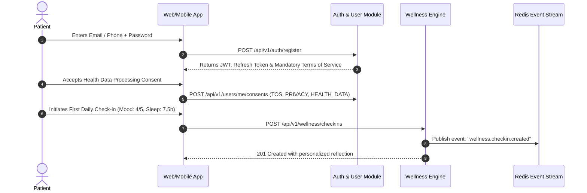
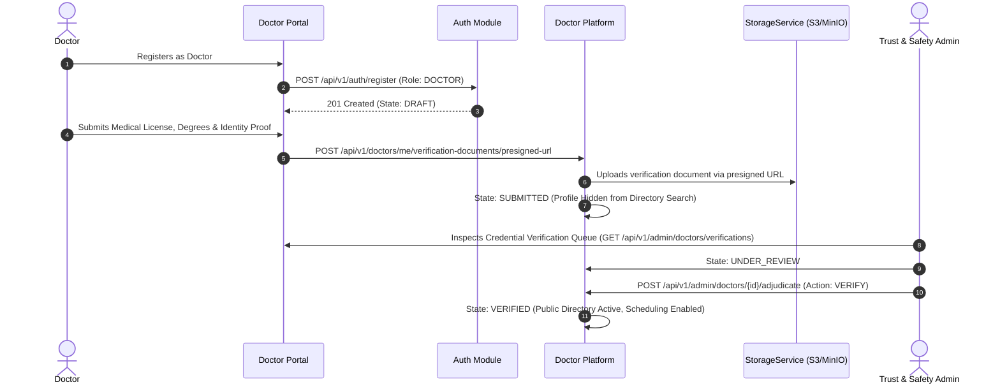
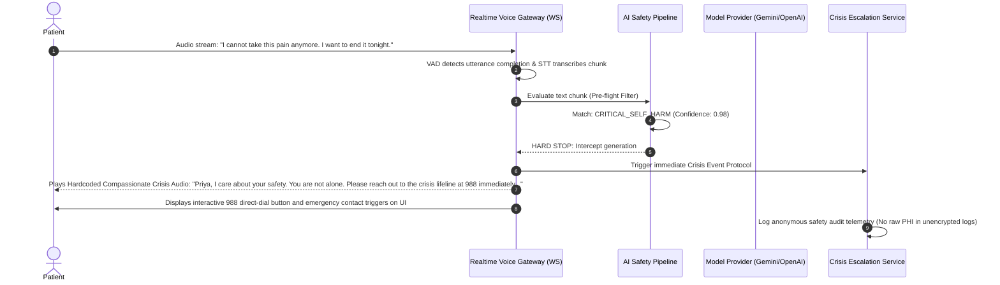

# MANVIA — End-to-End User Journeys & System Workflows

> Version: 0.1.0-phase0  
> Status: DRAFT — Phase 0 Specification  
> Last Updated: 2026-09-28  

---

## 1. Overview

This document formalizes the primary cross-domain user journeys in MANVIA. These state transitions and user touchpoints govern API design, asynchronous event sequences, and frontend UI expectations.

---

## 2. Core User Journey Maps

### Flow 1: Patient Registration, Consent Onboarding & First Wellness Check-in



**Key Business Rules:**
* Patient cannot access AI companion or health record storage until baseline terms and health data processing consent are acknowledged.
* All consent entries record the exact schema version, IP address, and cryptographic timestamp.

---

### Flow 2: Doctor Onboarding, Credential Submission & Manual Admin Verification



**Key Business Rules:**
* Doctor profile verification states follow the canonical lifecycle: `DRAFT → SUBMITTED → UNDER_REVIEW → MORE_INFORMATION_REQUIRED → VERIFIED / REJECTED`.
* Unverified doctors cannot publish availability slots, accept bookings, or issue medical notes.
* Verification status is strictly managed by authorized administrators with immutable audit logs.

---

### Flow 3: Appointment Booking, Payment Hold & Doctor Consultation Lifecycle

```mermaid
sequenceDiagram
    autonumber
    actor P as Patient
    participant Client as App
    participant Appt as Appointment Engine
    participant Pay as PaymentService (Mock/Stripe)
    actor D as Doctor
    participant EventBus as Redis Streams

    P->>Client: Selects Doctor Slot (Dr. Rajesh, Oct 2, 10:00 AM)
    Client->>Appt: POST /api/v1/appointments/reserve (Lock slot in Redis for 10 min)
    Appt-->>Client: Reservation ID + Payment Intent Token (State: RESERVED)
    P->>Client: Confirms Payment ($45 consultation)
    Client->>Pay: Process Payment Authorization (Mock simulator in Phase 13-18; Stripe in Phase 19)
    Pay-->>Appt: Webhook: payment.authorized
    Appt->>Appt: Transition state: RESERVED -> CONFIRMED
    Appt->>EventBus: Publish: "appointment.confirmed"
    EventBus->>D: Push Notification & Calendar Update
    Note over P,D: Consultation Time Arrives
    D->>Appt: POST /api/v1/consultations/{id}/start
    Appt->>Appt: State: IN_PROGRESS (Secure room unlocked)
    D->>Appt: Complete Consult + Submit Clinical Summary & Prescription
    Appt->>Appt: State: COMPLETED
    Appt->>Pay: Capture Authorized Payment
    Appt->>EventBus: Publish: "consultation.completed"
```

**Key Architectural Rules:**
* **Payment Abstraction:** In Phase 13, the appointment booking flow integrates with a `PaymentService` interface backed by a **Mock/Deferred Payment Provider & Event Simulator**. Real gateway integration (Stripe Connect) is bound in Phase 19 without altering the appointment state machine.
* **Authoritative Consistency Boundary:** Double-booking prevention is authoritatively enforced by PostgreSQL composite exclusion constraints (`EXCLUDE USING gist`), with Redis distributed locks (`Redlock`) providing load shedding.

---

### Flow 4: AI Companion Voice Check-in with Crisis Intervention Escalation



**Safety Invariants:**
* Under no circumstances may the generative model improvise counseling for explicit suicidal ideation.
* Response latency for crisis intercept must remain under 350ms measured from **VAD endpointing / utterance completion**.
