# MANVIA — Complete Entity Relationship Diagram (ERD)

> Version: 0.1.0-phase0  
> Status: DRAFT — Phase 0 Specification  
> Last Updated: 2026-09-28  

---

## 1. Relational Model Architecture

The MANVIA database architecture centers around the `User` identity entity, which anchors domain role profiles (`PatientProfile`, `DoctorProfile`, `AdminProfile`). Relationships, appointments, health records, prescriptions, and audit events maintain strict referential integrity.

---

## 2. Mermaid Entity Relationship Diagram

```mermaid
erDiagram
    User ||--o| PatientProfile : "has 0..1"
    User ||--o| DoctorProfile : "has 0..1"
    User ||--o| AdminProfile : "has 0..1"
    User ||--o{ UserSession : "maintains"
    User ||--o{ AuditLog : "initiates"
    User ||--o{ ConsentRecord : "authorizes"

    PatientProfile ||--o{ WellnessEntry : "logs"
    PatientProfile ||--o{ HealthRecord : "owns"
    PatientProfile ||--o{ Appointment : "books"
    PatientProfile ||--o{ CareRelationship : "participates in"
    PatientProfile ||--o{ AIConversation : "engages in"
    PatientProfile ||--o{ HealthTimelineEvent : "tracks"
    PatientProfile ||--o{ Prescription : "receives"

    DoctorProfile ||--o{ DoctorAvailability : "configures"
    DoctorProfile ||--o{ DoctorVerificationDoc : "submits"
    DoctorProfile ||--o{ ConsultationOffer : "defines"
    DoctorProfile ||--o{ Appointment : "conducts"
    DoctorProfile ||--o{ CareRelationship : "cares for"
    DoctorProfile ||--o{ Prescription : "authors"
    DoctorProfile ||--o{ DoctorSpecialty : "has"
    DoctorProfile ||--o{ DoctorLanguage : "speaks"

    Specialty ||--o{ DoctorSpecialty : "categorizes"
    Language ||--o{ DoctorLanguage : "includes"

    Appointment ||--|| PaymentTransaction : "requires"
    Appointment ||--o| ConsultationNote : "documents"
    Appointment ||--o{ Prescription : "prescribes"

    AIConversation ||--o{ AIMessage : "contains"
    AIConversation ||--o{ AISafetyIncident : "may trigger"

    User {
        uuid id PK
        text email_encrypted
        string email_bidx UK "HMAC blind index"
        text phone_encrypted
        string phone_bidx UK "HMAC blind index"
        string password_hash
        enum status "ACTIVE, SUSPENDED, DEACTIVATED, LOCKED"
        datetime created_at
        datetime updated_at
    }

    PatientProfile {
        uuid id PK
        uuid user_id FK,UK
        string public_patient_id UK "PAT-XXXXXXXX"
        string legal_first_name
        string legal_last_name
        date date_of_birth
        enum biological_sex "MALE, FEMALE, INTERSEX, OTHER"
        string emergency_contact_name
        string emergency_contact_phone
        datetime created_at
    }

    DoctorProfile {
        uuid id PK
        uuid user_id FK,UK
        string public_doctor_id UK "DOC-XXXXXXXX"
        string medical_registration_number UK
        string licensing_council
        enum verification_status "DRAFT, SUBMITTED, UNDER_REVIEW, MORE_INFORMATION_REQUIRED, VERIFIED, REJECTED, SUSPENDED, EXPIRED"
        int years_of_experience
        decimal default_consultation_fee
        datetime verified_at
        datetime created_at
    }

    Specialty {
        uuid id PK
        string code UK
        string name UK
        text description
        boolean is_active
    }

    DoctorSpecialty {
        uuid id PK
        uuid doctor_id FK
        uuid specialty_id FK
        boolean is_primary
    }

    Language {
        uuid id PK
        string iso_code UK
        string name
    }

    DoctorLanguage {
        uuid id PK
        uuid doctor_id FK
        uuid language_id FK
    }

    DoctorVerificationDoc {
        uuid id PK
        uuid doctor_id FK
        enum document_type "MEDICAL_LICENSE, DEGREE, ID_PROOF, MALPRACTICE_INS"
        string file_storage_uri
        string file_sha256
        enum status "SUBMITTED, ACCEPTED, REJECTED"
        uuid reviewed_by_admin_id FK
        datetime created_at
    }

    DoctorAvailability {
        uuid id PK
        uuid doctor_id FK
        enum day_of_week "MON, TUE, WED, THU, FRI, SAT, SUN"
        time start_time
        time end_time
        int slot_duration_minutes
        boolean is_active
    }

    CareRelationship {
        uuid id PK
        uuid patient_id FK
        uuid doctor_id FK
        enum status "PENDING, ACTIVE, TERMINATED, REVOKED"
        datetime established_at
        datetime valid_until
    }

    ConsentRecord {
        uuid id PK
        uuid user_id FK
        enum consent_type "TOS, PRIVACY_POLICY, PHI_PROCESSING, DOCTOR_RECORD_ACCESS"
        string document_version
        boolean granted
        string ip_address
        datetime recorded_at
    }

    Appointment {
        uuid id PK
        string public_appointment_id UK "APT-XXXXXXXX"
        uuid patient_id FK
        uuid doctor_id FK
        uuid consultation_offer_id FK
        enum status "RESERVED, REQUESTED, CONFIRMED, IN_PROGRESS, COMPLETED, CANCELLED, DECLINED, EXPIRED, NO_SHOW"
        datetime scheduled_start_time
        datetime scheduled_end_time
        decimal fee_amount
        string cancellation_reason
        datetime created_at
    }

    ConsultationNote {
        uuid id PK
        uuid appointment_id FK,UK
        uuid doctor_id FK
        uuid patient_id FK
        text subjective_notes_enc
        text objective_notes_enc
        text assessment_enc
        text plan_enc
        text follow_up_instructions
        datetime signed_at
        datetime created_at
    }

    Prescription {
        uuid id PK
        uuid appointment_id FK
        uuid consultation_note_id FK
        uuid doctor_id FK
        uuid patient_id FK
        string medication_name
        string dosage
        string frequency
        string route
        int duration_days
        text special_instructions
        enum status "ACTIVE, DISCONTINUED, EXPIRED, FILLED"
        datetime issued_at
    }

    PaymentTransaction {
        uuid id PK
        uuid appointment_id FK,UK
        uuid payer_user_id FK
        string payment_gateway_ref UK
        decimal amount
        string currency
        enum status "PENDING, AUTHORIZED, CAPTURED, REFUNDED, FAILED"
        string idempotency_key UK
        datetime created_at
    }

    HealthRecord {
        uuid id PK
        uuid patient_id FK
        uuid uploaded_by_user_id FK
        enum category "LAB_REPORT, PRESCRIPTION, CLINICAL_SUMMARY, IMAGING, DISCHARGE_SUMMARY"
        string document_title
        string s3_storage_key
        string file_mimetype
        int file_size_bytes
        string encrypted_dek
        datetime recorded_date
        datetime created_at
    }

    WellnessEntry {
        uuid id PK
        uuid patient_id FK
        int mood_score "1 to 5"
        int stress_score "1 to 5"
        decimal sleep_hours
        int energy_score "1 to 5"
        text journal_reflection_encrypted
        datetime logged_at
    }

    HealthTimelineEvent {
        uuid id PK
        uuid patient_id FK
        enum event_type "WELLNESS_LOG, APPOINTMENT, LAB_RESULT, MEDICATION_UPDATE, SYSTEM_MILESTONE"
        uuid source_entity_id
        string event_summary
        jsonb metadata
        datetime event_timestamp
    }

    AIConversation {
        uuid id PK
        uuid patient_id FK
        string session_token UK
        enum modality "TEXT, VOICE, AVATAR"
        enum status "ACTIVE, CLOSED, CRISIS_TERMINATED"
        datetime started_at
        datetime ended_at
    }

    AIMessage {
        uuid id PK
        uuid conversation_id FK
        enum role "USER, ASSISTANT, SYSTEM, TOOL"
        text content_encrypted
        int latency_ms
        jsonb tokens_usage
        datetime created_at
    }

    AISafetyIncident {
        uuid id PK
        uuid conversation_id FK
        enum severity "LOW, MEDIUM, HIGH, CRITICAL_CRISIS"
        string trigger_category "SELF_HARM, DIAGNOSIS_ATTEMPT, MED_ADVICE, PROFANITY"
        string action_taken "BLOCKED, REDIRECTED, CRISIS_HOTLINE_DISPATCHED"
        datetime timestamp
    }

    AuditLog {
        uuid id PK
        uuid actor_user_id FK
        string ip_address
        string user_agent
        string action_name
        string resource_type
        uuid resource_id
        jsonb diff_payload
        datetime created_at
    }
```

---

## 3. Structural Constraints & Invariants

1. **Foreign Key Deletion Rules:**
   * `User` deletions trigger cascade to `UserSession`, but `AuditLog`, `PaymentTransaction`, `HealthRecord`, and `ConsultationNote` enforce `ON DELETE RESTRICT` or soft-delete flags for regulatory retention.
2. **Double-Booking Authoritative Consistency Boundary:**
   * PostgreSQL composite exclusion constraints (`EXCLUDE USING gist (doctor_id WITH =, tsrange(scheduled_start_time, scheduled_end_time) WITH &&)`) serve as the authoritative database consistency boundary for conflicting reservations.
   * Redis distributed locks (`Redlock`) act as a low-latency load-shedding mechanism to prevent unnecessary concurrent database transactions.
3. **Audit Log Immutability:**
   * PostgreSQL row-level rule / trigger blocks `UPDATE` or `DELETE` on the `AuditLog` table.
