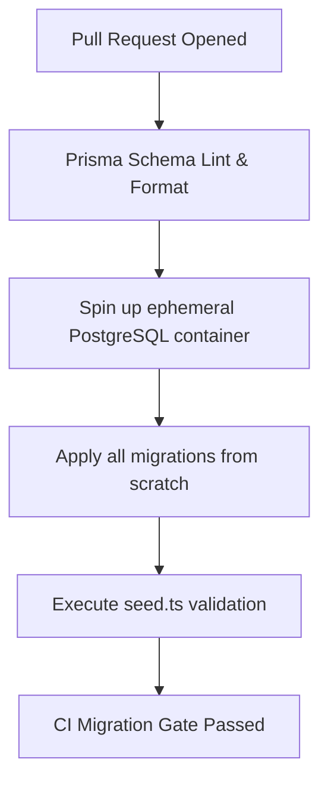

# MANVIA — Database Migration & Schema Evolution Strategy

> Version: 0.1.0-phase0  
> Status: DRAFT — Phase 0 Specification  
> Last Updated: 2026-09-28  

---

## 1. Migration Philosophy & Safety Principles

In a production healthcare application, database schema migrations must adhere to strict zero-downtime and data integrity guarantees:
1. **Never drop columns or tables in an active write path without a deprecation window.**
2. **Always separate schema changes from application deployment using the Expand/Contract Pattern.**
3. **Every forward migration must have a tested, non-destructive rollback strategy.**
4. **Locks must be bounded:** Migrations that hold table-level exclusive locks (`ACCESS EXCLUSIVE`) for more than 2 seconds are strictly prohibited in production.

---

## 2. Tooling Baseline

* **ORM & Migration Tool:** Prisma Migrate (`prisma migrate dev` for local development, `prisma migrate deploy` for staging and production).
* **Direct SQL Migrations:** For advanced PostgreSQL features (e.g. `pgvector` indexing, row-level security, composite exclusion constraints `tsrange`, partial indexes), standard Prisma migrations will embed raw SQL within `migration.sql` blocks.
* **Migration Tracking:** All migrations are committed to Git under `prisma/migrations/` and tracked in `_prisma_migrations`.

---

## 3. The Expand-and-Contract Migration Lifecycle

Whenever a breaking change or column rename is required, it must span at least three continuous deployment cycles:

```
Cycle 1: EXPAND
  - Add new column (nullable or with safe default).
  - Update backend code to write to BOTH old and new columns.
  - Read from old column (fallback to new).

Cycle 2: BACKFILL & SHIFT
  - Run background worker to backfill data from old column to new column.
  - Switch backend read path to new column.
  - Continue dual writes.

Cycle 3: CONTRACT
  - Stop writes to old column.
  - Remove old column in a final migration after verification.
```

---

## 4. Operational Safety Guidelines

### 4.1 Index Creation
* In production, never run `CREATE INDEX` on high-traffic tables (`wellness_entries`, `appointments`, `audit_logs`).
* Use `CREATE INDEX CONCURRENTLY` in a standalone SQL script or transaction-free block to prevent locking write transactions.

### 4.2 Adding Non-Null Columns
* Never add a column with `NOT NULL` without a default value on an existing table.
* **Correct Pattern:**
  1. Add column as nullable.
  2. Backfill existing records in batches.
  3. Alter column to `SET NOT NULL` once no null values exist.

### 4.3 Automated Lock Timeout
All production migration sessions must execute with an explicit statement and lock timeout:
```sql
SET lock_timeout = '2000ms';
SET statement_timeout = '10000ms';
```
If a table lock cannot be acquired within 2 seconds due to concurrent traffic, the migration aborts safely rather than queuing transactions and causing connection pool exhaustion.

---

## 5. Seed Strategy & Environment Isolation

* **Local Development (`prisma/seed.ts`):**
  * Seeds synthetic mock doctors, test patients, predefined wellness check-in histories, and sample consultation slots.
  * **Strict Invariant:** Absolutely no real patient or doctor identifiable data in seed files.
* **Staging:**
  * Automated migration testing using sanitized seed datasets.
* **Production:**
  * Only system-critical lookup tables are seeded (e.g. system permissions, ISO currency codes, medical specialties).

---

## 6. Migration CI/CD Pipeline


No PR modifying `schema.prisma` or migration files may merge without passing this pipeline.
