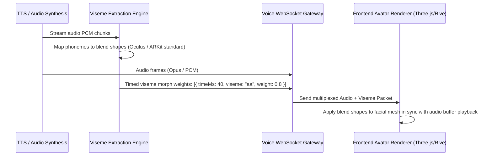

# MANVIA — Realtime Avatar System Specification

> Version: 0.1.0-phase0  
> Status: DRAFT — Phase 0 Specification  
> Last Updated: 2026-09-28  

---

## 1. Overview & Visual Presence Philosophy

The MANVIA AI Companion features an optional, warm, empathetic visual avatar to enhance presence, active listening cues, and therapeutic rapport.
The avatar design avoids hyper-realistic uncanny valley aesthetics in favor of a clean, softly stylized, modern humanoid figure with calming expressions.

---

## 2. Rendering Tiers & Client Capabilities

To support both high-end desktop web browsers and budget mobile Android devices without thermal throttling:

| Tier | Technology | Visual Fidelity | Target Devices | Frame Rate |
|---|---|---|---|---|
| **Tier A (High Fidelity 3D)** | WebGL / Three.js + Morph Targets | 3D stylized character, dynamic lighting, subtle idle breathing, micro-nodding. | Desktop Chrome/Safari, flagship iOS/Android devices. | 60 FPS |
| **Tier B (2D Vector Animation)** | Lottie / Rive State Machine | Fluid 2D animated avatar with expressive facial morphs and lip-sync phonemes. | Mid-range to entry-level mobile devices, low-battery mode. | 30-60 FPS |
| **Tier C (Audio Only / Ambient Waveform)** | Canvas / SVG Waveform | Elegant pulsating concentric gradient orb reacting to voice pitch/amplitude. | Low-bandwidth networks (< 200 kbps) or user audio-only preference. | Minimal CPU |

---

## 3. Realtime Viseme & Animation Pipeline

To achieve synchronized lipsync with sub-100ms visual jitter, viseme metadata is multiplexed with synthesized voice audio:

---

## 4. Emotional Micro-Expressions

The avatar engine drives continuous emotional state reflection:
* **Listening State:** Periodic soft micro-nodding, attentive eye contact, relaxed shoulders.
* **Reflective Thinking State:** Subtle upward eye drift, mouth closed, gentle breathing loop.
* **Empathetic Responding State:** Warm smile, soft eyebrow arch, open posture.
* **Crisis State:** Solemn, reassuring posture, steady eye contact, immediately clears animated gestures to focus entirely on emergency guidance.

---

## 5. Performance & Battery Constraints

* **Maximum Texture Budget:** 2048x2048 compressed KTX2 / Basis Universal textures (under 4MB download total).
* **Maximum Polygon Budget:** Under 35,000 triangles for Tier A 3D avatar mesh.
* **Automatic Throttling:** If client battery is under 20% or thermal throttling is detected, the frontend silently falls back from Tier A (3D WebGL) to Tier B (Rive/Lottie) or Tier C (Waveform).
