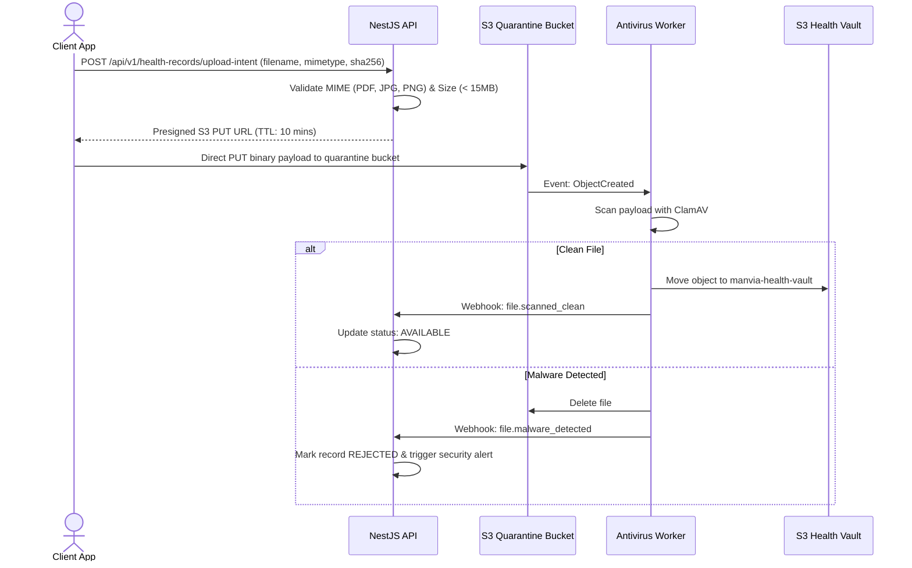

# MANVIA — Object Storage & Document Architecture

> Version: 0.1.0-phase0  
> Status: DRAFT — Phase 0 Specification  
> Last Updated: 2026-09-28  

---

## 1. Storage Architecture Overview

All unstructured documents (lab reports, doctor credentials, medical imaging, consultation audio recordings) reside in S3-compatible object storage.
**Key Architectural Principles:**
1. **Never pass binary file streams through NestJS backend servers.** All uploads and downloads use short-lived Presigned URLs.
2. **Zero PII in Object Keys:** Object keys are opaque UUIDs with no names, dates of birth, or clinical descriptions in the path.
3. **Automated Asynchronous Virus Scanning:** Files are quarantined in a restricted bucket until scanned and approved.

---

## 2. Bucket Topology & Segregation

```
+-------------------------------------------------------------+
| 1. Quarantined Upload Bucket (Write-only for Presigned Put)  |
|    manvia-quarantine-uploads-prod                           |
+-------------------------------------------------------------+
                              |
                              v [S3 Event Trigger -> Lambda / Worker]
                 +--------------------------+
                 | ClamAV / Malware Scanner |
                 +--------------------------+
                   |                      |
                   v (Clean)              v (Infected)
+-------------------------------+      +----------------------+
| 2. Encrypted Production Vault |      | Quarantine Reject    |
|    manvia-health-vault-prod   |      | (Delete & Alert Sec) |
+-------------------------------+      +----------------------+
```

| Bucket Name | Purpose | Encryption | Access Control |
|---|---|---|---|
| `manvia-quarantine-uploads` | Transient buffer for presigned user uploads. TTL: 24h. | SSE-KMS | Direct PUT via Presigned URL only. No public read. |
| `manvia-health-vault` | Permanent encrypted clinical records, lab PDFs, prescriptions. | SSE-KMS + Field DEK | Private. Access strictly via Presigned GET URLs (max 15 min TTL). |
| `manvia-doctor-credentials` | Medical licenses, degrees, government ID proof. | SSE-KMS | Read-only for verified compliance admins. |
| `manvia-public-assets` | Doctor profile avatars, platform icons, UI media. | SSE-S3 | Public Read via CloudFront CDN. |

---

## 3. Presigned URL Upload & Download Flow

### 3.1 Presigned Upload Flow


---

## 4. Lifecycle Policies & Retention

* **Quarantine Bucket:** Lifecycle rule automatically purges un-scanned objects older than 24 hours.
* **Health Records Vault:**
  * Retention: Indefinite / minimum 7 years per healthcare compliance standards.
  * S3 Object Lock (WORM - Write Once, Read Many) in Compliance Mode prevents accidental or malicious deletion of clinical charts.
  * Glacier Transition: Move records not accessed in 365 days to S3 Glacier Instant Retrieval for cost reduction without impacting read latency.
